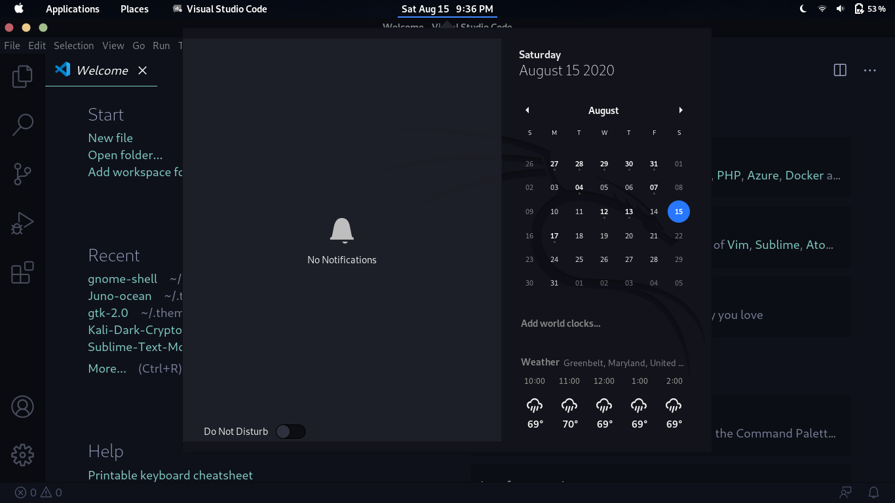
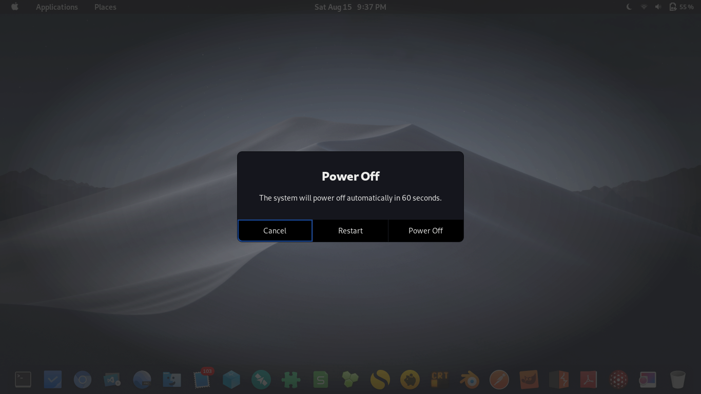

# Kali-Ocean Gnome Shell Theme

Gnome Desktop shell theme intended to match GTK, Visual Studio Code, terminal that also use the ocean theme. For people who have a preference for a shell theme using ocean colors, but don't like the way Kali's warmer hued grays clash.

Still in active development, but posted to keep track of improvements.

### Calendar View (with Juno-ocean GTK theme)


### Shutdown View


## Installation
In your terminal, move Kali-Ocean to the appropriate themes directory:
``` 
git clone https://github.com/cryptoboxcomics/Kali-Ocean.git

# If you want to install it locally
mkdir ~/.themes
mv Kali-Ocean ~/.themes

# If you want to install it globally for all users
mv Kali-Ocean /usr/share/themes
```
Make sure gnome-tweaks is installed.
```
sudo apt-get install gnome-tweaks
gnome-tweaks
```
A window should open. Navigate to Appearance, and change Shell value ot Kali-Ocean.